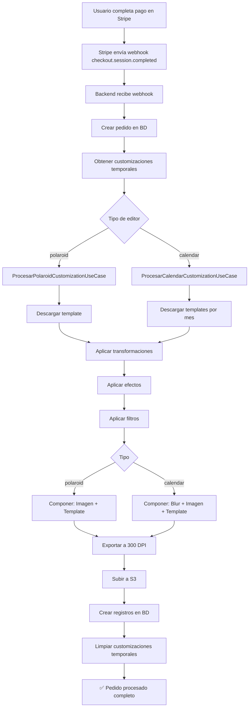

# Resumen Completo: Procesamiento de Customizaciones (Polaroids + Calendarios)

## 📋 Estado Actual

### ✅ Implementado en Backend

| Componente | Polaroids | Calendarios |
|------------|-----------|-------------|
| **Service** | ✅ `PolaroidProcessingService` | ✅ `CalendarProcessingService` |
| **Use Case** | ✅ `ProcesarPolaroidCustomizationUseCase` | ✅ `ProcesarCalendarCustomizationUseCase` |
| **Documentación** | ✅ `POLAROID_PROCESSING_GUIDE.md` | ✅ `CALENDAR_INTEGRATION_GUIDE.md` |
| **Integración** | ✅ **COMPLETA** | ✅ **COMPLETA** |

### ✅ Estado Actual

**La integración está completa y funcional.**

Cuando un usuario crea un pedido con polaroids o calendarios:
- ✅ Las imágenes se procesan automáticamente después del pago
- ✅ Se aplican templates correctamente
- ✅ Se aplican transformaciones y efectos
- ✅ Los registros se crean en la base de datos
- ✅ Para calendarios: se vincula cada mes con su foto en `calendario_fotos`


---

## 🎯 Solución: Integrar en el Webhook de Stripe

### Código de Integración Completo

```typescript
import { ProcesarPolaroidCustomizationUseCase } from '@application/use-cases/procesar-polaroid-customization.use-case';
import { ProcesarCalendarCustomizationUseCase } from '@application/use-cases/procesar-calendar-customization.use-case';
import { CustomizacionTemporalRepositoryPort } from '@domain/ports/customizacion-temporal.repository.port';
import { FotoRepositoryPort } from '@domain/ports/foto.repository.port';
import { CalendarioFotoRepositoryPort } from '@domain/ports/calendario-foto.repository.port';

/**
 * Handler para el evento checkout.session.completed de Stripe
 */
async function handleCheckoutSessionCompleted(
  session: any,
  customizacionRepository: CustomizacionTemporalRepositoryPort,
  fotoRepository: FotoRepositoryPort,
  calendarioFotoRepository: CalendarioFotoRepositoryPort
) {
  // 1. Crear el pedido (código existente)
  const pedido = await crearPedidoDesdeStripeSession(session);

  // 2. Obtener customizaciones temporales del usuario
  const customizaciones = await customizacionRepository.findByUserId(pedido.usuario_id);

  if (!customizaciones || customizaciones.length === 0) {
    console.log('No hay customizaciones para procesar');
    return;
  }

  // 3. Inicializar use cases
  const procesarPolaroidUseCase = new ProcesarPolaroidCustomizationUseCase();
  const procesarCalendarUseCase = new ProcesarCalendarCustomizationUseCase();

  // 4. Procesar cada customización según su tipo
  for (const customizacion of customizaciones) {
    // Encontrar el item_pedido correspondiente
    const itemPedido = pedido.items?.find(item =>
      item.cart_item_id === customizacion.cart_item_id &&
      item.instance_index === customizacion.instance_index
    );

    if (!itemPedido || !itemPedido.id) {
      console.warn(`No se encontró item_pedido para customizacion ${customizacion.id}`);
      continue;
    }

    try {
      // ✅ PROCESAR POLAROIDS
      if (customizacion.editor_type === 'polaroid') {
        console.log(`Procesando polaroid para item ${itemPedido.id}...`);

        const result = await procesarPolaroidUseCase.execute(
          customizacion.datos,
          pedido.id!,
          itemPedido.id
        );

        if (result.success && result.data) {
          // Crear foto por cada polaroid procesado
          for (const imagen of result.data.processedImages) {
            const foto = await fotoRepository.create({
              usuario_id: pedido.usuario_id!,
              pedido_id: pedido.id!,
              item_pedido_id: itemPedido.id,
              nombre_archivo: `polaroid_${Date.now()}.png`,
              ruta_almacenamiento: imagen.s3Key,  // KEY, no URL
              tamaño_archivo: 0,
              ancho_foto: customizacion.datos.widthInches || 4,
              alto_foto: customizacion.datos.heightInches || 6,
              resolucion_foto: 300,
              cantidad_copias: imagen.copies,
              procesada: true
            });

            console.log(`✅ Foto polaroid creada: ${foto.id} (${imagen.copies} copias)`);
          }
        } else {
          console.error(`❌ Error procesando polaroid: ${result.message}`);
        }
      }

      // ✅ PROCESAR CALENDARIOS
      else if (customizacion.editor_type === 'calendar') {
        console.log(`Procesando calendario para item ${itemPedido.id}...`);

        const result = await procesarCalendarUseCase.execute(
          customizacion.datos,
          pedido.id!,
          itemPedido.id
        );

        if (result.success && result.data) {
          // Crear foto por cada mes procesado
          for (const month of result.data.processedMonths) {
            const foto = await fotoRepository.create({
              usuario_id: pedido.usuario_id!,
              pedido_id: pedido.id!,
              item_pedido_id: itemPedido.id,
              nombre_archivo: `calendar_month_${month.month}.png`,
              ruta_almacenamiento: month.s3Key,  // KEY, no URL
              tamaño_archivo: 0,
              ancho_foto: customizacion.datos.widthInches || 8.5,
              alto_foto: customizacion.datos.heightInches || 11,
              resolucion_foto: 300,
              cantidad_copias: 1,
              procesada: true
            });

            // Crear relación mes-foto en tabla calendario_fotos
            await calendarioFotoRepository.create({
              pedido_id: pedido.id!,
              item_pedido_id: itemPedido.id,
              mes: month.month,
              foto_id: foto.id!
            });

            console.log(`✅ Mes ${month.month} de calendario procesado: foto ${foto.id}`);
          }
        } else {
          console.error(`❌ Error procesando calendario: ${result.message}`);
        }
      }
    } catch (error: any) {
      console.error(`Error procesando customización ${customizacion.id}:`, error);
      // No lanzar error para no bloquear el webhook
    }
  }

  // 5. Limpiar customizaciones temporales (opcional)
  try {
    await customizacionRepository.deleteByUserId(pedido.usuario_id!);
    console.log(`Customizaciones temporales limpiadas para usuario ${pedido.usuario_id}`);
  } catch (error) {
    console.warn('Error limpiando customizaciones temporales:', error);
  }

  console.log(`✅ Procesamiento de customizaciones completado para pedido ${pedido.id}`);
}
```

---

## 📁 Archivos Creados

### Services
```
✅ src/infrastructure/services/polaroid-processing.service.ts
✅ src/infrastructure/services/calendar-processing.service.ts
```

### Use Cases
```
✅ src/application/use-cases/procesar-polaroid-customization.use-case.ts
✅ src/application/use-cases/procesar-calendar-customization.use-case.ts
```

### Documentación
```
✅ docs/POLAROID_PROCESSING_GUIDE.md
✅ docs/POLAROID_INTEGRATION_GUIDE.md
✅ docs/CALENDAR_INTEGRATION_GUIDE.md
✅ docs/CUSTOMIZATION_PROCESSING_SUMMARY.md (este archivo)
```

---

## 📊 Comparación: Polaroids vs Calendarios

| Característica | Polaroids | Calendarios |
|----------------|-----------|-------------|
| **Templates** | 1 único template | 12 templates (uno por mes) |
| **Fondo** | Transparente | Difuminado (blur) |
| **Área de foto** | Centro | Parte superior (47%) |
| **Composición** | Imagen + Template | Fondo blur + Imagen + Template |
| **Copias** | Variable (campo `copies`) | Siempre 1 copia |
| **Registros BD** | 1 foto con N copias | N fotos (1 por mes) + N registros en `calendario_fotos` |
| **S3 Path** | `pedidos/{id}/items/{id}/polaroid_{ts}_{i}.png` | `pedidos/{id}/items/{id}/calendar_{mes}_{ts}.png` |

---

## 🔄 Flujo Completo



---

## 📋 Checklist de Integración

### Paso 1: Verificar Dependencias
- [x] `node-fetch` instalado (`bun add node-fetch @types/node-fetch`)
- [x] `sharp` instalado (ya existe en proyecto)
- [x] Servicios de S3 configurados

### Paso 2: Ubicar Punto de Integración
- [x] ✅ Integrado en webhook handler de Stripe (`procesar-webhook-stripe.use-case.ts`)
- [x] ✅ Webhook routes actualizado con todas las dependencias
- [x] ✅ Procesamiento automático al confirmar pago

### Paso 3: Agregar Imports
```typescript
import { ProcesarPolaroidCustomizationUseCase } from '@application/use-cases/procesar-polaroid-customization.use-case';
import { ProcesarCalendarCustomizationUseCase } from '@application/use-cases/procesar-calendar-customization.use-case';
```

### Paso 4: Inicializar Use Cases
```typescript
const procesarPolaroidUseCase = new ProcesarPolaroidCustomizationUseCase();
const procesarCalendarUseCase = new ProcesarCalendarCustomizationUseCase();
```

### Paso 5: Procesar Customizaciones
- [x] ✅ Obtener customizaciones temporales
- [x] ✅ Detectar tipo (polaroid / calendar)
- [x] ✅ Llamar use case correspondiente
- [x] ✅ Crear registros de fotos
- [x] ✅ Para calendarios: crear registros en `calendario_fotos`

### Paso 6: Testing
- [ ] Probar con pedido de polaroid (1 imagen)
- [ ] Probar con pedido de calendario (1 mes)
- [ ] Probar con pedido de calendario (12 meses)
- [ ] Verificar imágenes en S3 tengan templates aplicados
- [ ] Verificar registros en BD sean correctos

---

## 🧪 Testing Manual

### 1. Crear Pedido con Polaroid

```bash
# 1. Crear customización temporal
POST /api/customizaciones-temporales
{
  "cart_item_id": "test-polaroid-1",
  "editor_type": "polaroid",
  "datos": {
    "templateUrl": "/polaroid/Polaroid.png",
    "polaroids": [...]
  }
}

# 2. Crear sesión de checkout
POST /api/checkout/create-session

# 3. Pagar en Stripe (simulación o real)

# 4. Verificar en S3:
aws s3 ls s3://fotogifty/pedidos/{pedido_id}/items/{item_id}/

# Debe existir: polaroid_{timestamp}_0.png
```

### 2. Crear Pedido con Calendario

```bash
# Similar al de polaroid, pero con:
"editor_type": "calendar",
"datos": {
  "monthTemplates": { "1": "...", "2": "...", ... },
  "months": [...]
}

# Debe crear 12 archivos en S3:
# calendar_enero_{ts}.png
# calendar_febrero_{ts}.png
# ...
# calendar_diciembre_{ts}.png
```

---

## 🐛 Troubleshooting

### Problema: No se procesan las customizaciones
**Diagnóstico:**
```typescript
console.log('Customizaciones encontradas:', customizaciones.length);
console.log('Editor types:', customizaciones.map(c => c.editor_type));
```

**Solución:** Verificar que las customizaciones temporales existan en BD antes del webhook.

### Problema: "Template not found"
**Diagnóstico:**
```typescript
console.log('Template URL:', templateUrl);
console.log('S3 Key:', key);
```

**Solución:** Verificar que los templates existan en S3 en las rutas especificadas.

### Problema: Imágenes aparecen en blanco
**Diagnóstico:**
```typescript
const result = await procesarPolaroidUseCase.execute(...);
console.log('Resultado:', result);
console.log('Imágenes procesadas:', result.data?.processedImages.length);
```

**Solución:** Verificar que `imageSrc` sea válido (data URL o S3 URL accesible).

### Problema: CORS en templates
**Frontend:** Si hay error "Tainted canvas", agregar `crossOrigin="anonymous"` al cargar imágenes.
**Backend:** Si hay error descargando desde S3, configurar CORS en el bucket.

---

## 📝 Notas Importantes

### 1. Guardar Keys, No URLs
```typescript
// ✅ CORRECTO
ruta_almacenamiento: imagen.s3Key  // "pedidos/123/items/456/polaroid_123456.png"

// ❌ INCORRECTO
ruta_almacenamiento: imagen.s3Url  // "https://fotogifty.s3...."
```

**Razón:** Las signed URLs expiran. Guardar el key permite generar URLs bajo demanda.

### 2. Tabla `calendario_fotos`
Esta tabla es **esencial** para calendarios. Relaciona cada mes con su foto:
```sql
INSERT INTO calendario_fotos (pedido_id, item_pedido_id, mes, foto_id)
VALUES (123, 456, 1, 789);  -- Enero → Foto ID 789
```

### 3. Limpieza de Customizaciones Temporales
**Recomendación:** Limpiar DESPUÉS de procesar exitosamente, no antes.
```typescript
// ✅ CORRECTO
await procesarCustomizaciones();
await customizacionRepository.deleteByUserId(userId);

// ❌ INCORRECTO (pierdes los datos)
await customizacionRepository.deleteByUserId(userId);
await procesarCustomizaciones();  // ← No hay datos!
```

### 4. Manejo de Errores
No lanzar errores en el webhook que bloqueen el procesamiento completo:
```typescript
try {
  await procesarCustomizacion(c);
} catch (error) {
  console.error('Error procesando customización:', error);
  // Continuar con la siguiente customización
}
```

---

## ✅ Resumen Final

| Estado | Componente |
|--------|-----------|
| ✅ | PolaroidProcessingService implementado |
| ✅ | CalendarProcessingService implementado |
| ✅ | Use cases implementados |
| ✅ | Documentación completa |
| ✅ | **Integración completa en webhook de Stripe** |
| ✅ | Vinculación mes-foto en tabla calendario_fotos |

**Estado:** Sistema completo y listo para usar. Las customizaciones se procesan automáticamente al confirmar pagos en Stripe.

---

## 📞 Contacto

Para dudas sobre la implementación:
1. Revisar `docs/POLAROID_INTEGRATION_GUIDE.md`
2. Revisar `docs/CALENDAR_INTEGRATION_GUIDE.md`
3. Ver código de servicios en `src/infrastructure/services/`
4. Ver código de use cases en `src/application/use-cases/`
