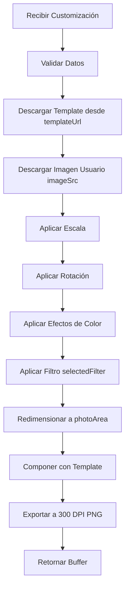

# Guía de Procesamiento de Polaroids - Backend

## 📋 Resumen

El backend ahora puede procesar customizaciones de tipo `polaroid` recibidas desde el frontend, aplicando todas las transformaciones, efectos y filtros especificados, y exportando a 300 DPI.

---

## 🎨 Servicio Implementado: `PolaroidProcessingService`

**Ubicación:** `src/infrastructure/services/polaroid-processing.service.ts`

### Capacidades

✅ **Descarga de templates**: Soporta URLs de S3, URLs externas y rutas relativas
✅ **Descarga de imágenes de usuario**: Soporta data URLs (base64) y URLs de S3
✅ **Transformaciones**:
  - Escala (scale)
  - Rotación (rotation)
  - Posicionamiento (posX, posY)

✅ **Efectos de color**:
  - Brillo (brightness: -100 a +100)
  - Contraste (contrast: -100 a +100)
  - Saturación (saturation: -100 a +100)
  - Sepia (sepia: 0 a 100)

✅ **Filtros predefinidos**:
  - `none` - Sin filtro
  - `grayscale` - Blanco y negro
  - `sepia` - Sepia completo
  - `vintage` - Estilo vintage (sepia suave + contraste reducido)
  - `warm` - Tonos cálidos (más rojos y amarillos)
  - `cool` - Tonos fríos (más azules)
  - `high_contrast` - Alto contraste

✅ **Composición**:
  - Redimensiona imagen del usuario al área de foto del template
  - Superpone el template PNG transparente
  - Exporta a 300 DPI

---

## 📥 Formato de Datos de Entrada

El frontend envía una customización con este formato:

```typescript
{
  "editorType": "polaroid",
  "data": {
    // Dimensiones del canvas en píxeles (usadas para cálculos de proporción)
    "canvasWidth": 1200,
    "canvasHeight": 1800,

    // Dimensiones físicas de impresión
    "widthInches": 4,
    "heightInches": 6,

    // Resolución de exportación (siempre 300 para impresión)
    "exportResolution": 300,

    // URL del template PNG (puede ser S3, URL externa o ruta relativa)
    "templateUrl": "/polaroid/Polaroid.png",

    // Área transparente donde va la foto del usuario (en coordenadas del canvas)
    "photoArea": {
      "x": 100,          // Posición X en el canvas
      "y": 120,          // Posición Y en el canvas
      "width": 1000,     // Ancho del área de foto
      "height": 1200     // Alto del área de foto
    },

    // Array de polaroids (normalmente 1, pero soporta múltiples)
    "polaroids": [
      {
        // Imagen del usuario (data URL base64 o URL de S3)
        "imageSrc": "data:image/jpeg;base64,/9j/4AAQ...",

        // Transformaciones aplicadas por el usuario en el editor
        "transformations": {
          "scale": 1.2,      // Factor de escala (1.0 = 100%)
          "rotation": 15,    // Rotación en grados
          "posX": 10,        // Desplazamiento horizontal
          "posY": -5         // Desplazamiento vertical
        },

        // Efectos de color
        "effects": {
          "brightness": 10,   // -100 a +100
          "contrast": 5,      // -100 a +100
          "saturation": -10,  // -100 a +100
          "sepia": 0          // 0 a 100
        },

        // Filtro aplicado
        "selectedFilter": "vintage",

        // Número de copias físicas a imprimir
        "copies": 3
      }
    ]
  }
}
```

---

## 🔄 Flujo de Procesamiento



### Paso a Paso

1. **Validación**
   - Verifica que todos los campos requeridos estén presentes
   - Valida tipos de datos

2. **Descarga de Template**
   - Si `templateUrl` contiene S3, extrae el key y descarga desde S3
   - Si es ruta relativa (`/polaroid/...`), busca en S3
   - Si es URL externa, descarga con `fetch`

3. **Descarga de Imagen Usuario**
   - Si `imageSrc` es data URL (`data:image/...`), decodifica base64
   - Si es URL de S3, descarga desde S3
   - Si es URL externa, descarga con `fetch`

4. **Aplicar Transformaciones**
   - **Escala**: Redimensiona imagen usando `sharp.resize()` con kernel `lanczos3` (alta calidad)
   - **Rotación**: Rota imagen con `sharp.rotate()`, fondo transparente

5. **Aplicar Efectos**
   - **Brightness**: Conversión -100/+100 → multiplicador 0.5-1.5
   - **Contrast**: Conversión -100/+100 → multiplicador 0.5-1.5 con `linear()`
   - **Saturation**: Conversión -100/+100 → multiplicador 0.5-1.5 con `modulate()`
   - **Sepia**: Conversión 0-100% → matriz de recomposición RGB

6. **Aplicar Filtro**
   - Consulta filtro en `selectedFilter`
   - Aplica matriz de color o ajustes específicos

7. **Composición**
   - Calcula dimensiones finales: `widthInches * exportResolution` (ej: 4" × 300 DPI = 1200px)
   - Redimensiona imagen usuario al tamaño del `photoArea` escalado
   - Redimensiona template al tamaño final
   - Crea canvas transparente
   - Compone: 1) Imagen usuario en posición `photoArea`, 2) Template encima

8. **Exportación**
   - Embebe metadatos: `density: 300, icc: 'srgb'`
   - Exporta como PNG de alta calidad

---

## 📤 Salida del Procesamiento

```typescript
interface ProcessedPolaroidResult {
  buffer: Buffer;      // Imagen PNG procesada
  width: number;       // Ancho en píxeles (ej: 1200px)
  height: number;      // Alto en píxeles (ej: 1800px)
  copies: number;      // Número de copias a imprimir
}
```

---

## 🎯 Uso del Servicio

```typescript
import { PolaroidProcessingService } from './polaroid-processing.service';

const service = new PolaroidProcessingService();

// Procesar customización completa (retorna array de resultados)
const results = await service.processCustomization(customizationData);

// Procesar un solo polaroid
const result = await service.processSinglePolaroid(
  polaroidData,
  customizationData
);

// El buffer resultante puede:
// 1. Subirse a S3
const s3Service = new S3Service();
const s3Url = await s3Service.uploadBuffer(
  result.buffer,
  `polaroids/processed/${userId}/${timestamp}.png`,
  'image/png'
);

// 2. Enviarse directamente al cliente
res.set('Content-Type', 'image/png');
res.send(result.buffer);

// 3. Guardarse localmente
await Bun.write('output.png', result.buffer);
```

---

## 🧪 Validación de Datos

```typescript
const service = new PolaroidProcessingService();

if (!service.validateCustomizationData(data)) {
  throw new Error('Datos de customización inválidos');
}

// Ahora es seguro procesar
const results = await service.processCustomization(data);
```

---

## ⚠️ Consideraciones Importantes

### 1. **TemplateUrl**
El template PNG **debe tener transparencia** en el área donde irá la foto del usuario. El servicio:
- Descarga el template
- Coloca la imagen del usuario DEBAJO del template
- El template se superpone, dejando ver la imagen en las áreas transparentes

### 2. **PhotoArea**
Las coordenadas de `photoArea` son **relativas al canvasWidth/canvasHeight** del editor. El servicio escala proporcionalmente al tamaño final de exportación.

**Ejemplo:**
```typescript
// Editor: 1200px × 1800px
photoArea: { x: 100, y: 120, width: 1000, height: 1200 }

// Export: 4in × 6in a 300 DPI = 1200px × 1800px
// photoArea escalado: { x: 100, y: 120, width: 1000, height: 1200 }
// (en este caso no cambia porque las dimensiones coinciden)

// Si el export fuera diferente, ej: 8in × 12in a 300 DPI = 2400px × 3600px
// photoArea escalado: { x: 200, y: 240, width: 2000, height: 2400 }
```

### 3. **Efectos vs Filtros**
- **Efectos** (brightness, contrast, etc.) se aplican **ANTES** de los filtros
- **Filtros** son transformaciones de color completas que se aplican **DESPUÉS**

### 4. **Calidad de Imagen**
- Usa `lanczos3` kernel para redimensionamiento (máxima calidad)
- Exporta PNG para preservar transparencias
- Embebe perfil ICC sRGB IEC61966-2.1
- Embebe 300 DPI en metadatos EXIF

### 5. **Performance**
- Procesamiento de un polaroid: ~2-5 segundos
- Procesamiento depende de:
  - Tamaño de imagen original
  - Número de efectos aplicados
  - Velocidad de descarga de S3

---

## 🔧 Troubleshooting

### ❌ Error: "Failed to download template"
**Causa:** La `templateUrl` no es accesible
**Solución:** Verifica que:
- El template existe en S3
- La URL es correcta
- Los permisos de S3 permiten lectura

### ❌ Error: "Failed to download user image"
**Causa:** La `imageSrc` no es válida
**Solución:** Verifica que:
- Si es data URL, el formato base64 es correcto
- Si es S3 URL, el key existe
- El archivo es una imagen válida (JPEG, PNG)

### ❌ La imagen final se ve distorsionada
**Causa:** Dimensiones de `photoArea` no coinciden con aspect ratio de la imagen
**Solución:** El servicio usa `fit: 'cover'`, que recorta la imagen. Ajusta `photoArea` en el frontend para que coincida con el aspect ratio de la imagen.

### ❌ Los efectos no se ven como en el editor
**Causa:** Diferencias en cómo canvas y Sharp aplican efectos
**Solución:** Ajusta los multiplicadores en `applyTransformationsAndEffects()` para que coincidan con el preview del frontend.

---

## 🚀 Próximos Pasos

Para integrar completamente:

1. **Crear Use Case**: `procesar-polaroid.use-case.ts`
2. **Crear Controller**: Endpoint POST `/api/polaroid/process`
3. **Crear Route**: Registrar en `routes/index.ts`
4. **Agregar a Pedidos**: Integrar con el flujo de creación de pedidos

---

## 📊 Ejemplo Completo

```typescript
// Frontend envía
const customization = {
  editorType: 'polaroid',
  data: {
    canvasWidth: 1200,
    canvasHeight: 1800,
    widthInches: 4,
    heightInches: 6,
    exportResolution: 300,
    templateUrl: '/polaroid/Polaroid.png',
    photoArea: { x: 100, y: 120, width: 1000, height: 1200 },
    polaroids: [{
      imageSrc: 'data:image/jpeg;base64,...',
      transformations: { scale: 1.2, rotation: 15, posX: 10, posY: -5 },
      effects: { brightness: 10, contrast: 5, saturation: -10, sepia: 0 },
      selectedFilter: 'vintage',
      copies: 3
    }]
  }
};

// Backend procesa
const service = new PolaroidProcessingService();
const results = await service.processCustomization(customization.data);

// results[0]:
// {
//   buffer: <Buffer 89 50 4e 47 ...>,  // PNG de 1200x1800 a 300 DPI
//   width: 1200,
//   height: 1800,
//   copies: 3
// }

// Subir a S3
const s3Url = await s3Service.uploadBuffer(
  results[0].buffer,
  `processed/polaroid_${Date.now()}.png`,
  'image/png'
);

// Crear registro en BD
await createFoto({
  ruta_almacenamiento: s3Url,
  cantidad_copias: results[0].copies,
  ancho_foto: 4,
  alto_foto: 6,
  resolucion_foto: 300
});
```

---

## 📝 Notas Finales

- El servicio está **listo para usar** sin cambios adicionales
- Es **extensible**: puedes agregar más filtros en `applyFilter()`
- Es **robusto**: maneja errores de descarga y procesamiento
- Es **eficiente**: usa Sharp (librería nativa C++) para máximo rendimiento

Para cualquier duda, revisa el código en:
`src/infrastructure/services/polaroid-processing.service.ts`
